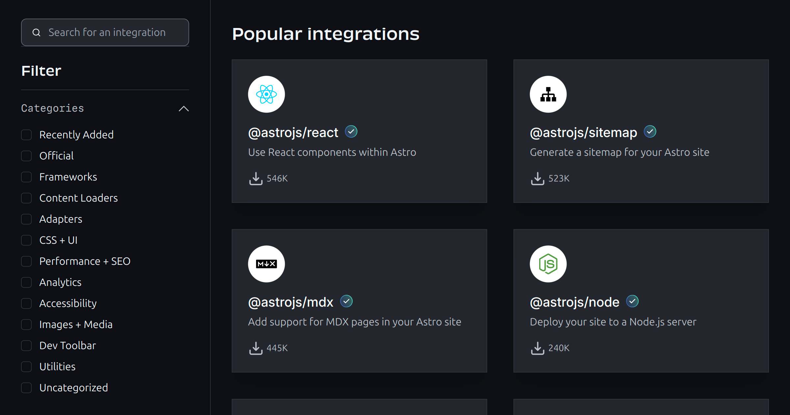

# 2.1. Where to find them

- Use our integration catalogue! **https://astro.build/integrations**

- Unlock UI frameworks like React and Vue with a renderer (`@astrojs/react`...)
- Enable on-demand rendering with an SSR adapter (`@astrojs/netlify`...)
- Integrate tools like Partytown (`@astrojs/partytown`)
- Add new features to your project, like automatic sitemap generation (`@astrojs/sitemap`)
- Write custom code that hooks into the build process, dev server, and more