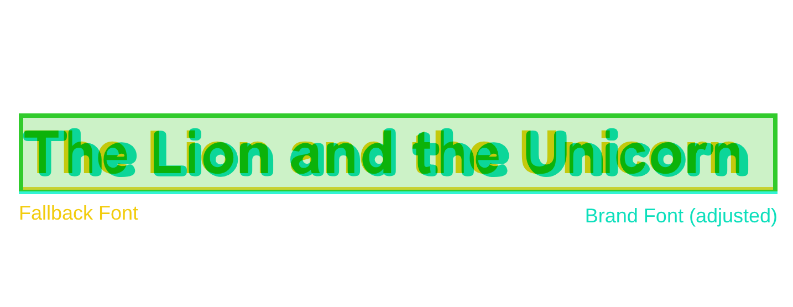

# Generating <span class="text-gradient font-normal">fallbacks</span>

Reduce CLS by adjusting the fallback font

````md magic-move
```css
body {
    font-family: Roboto, Arial, sans-serif;
}
```

```css
body {
    font-family: Roboto, 'Roboto fallback Arial', sans-serif;
}
```
````



<!-- Source: https://screenspan.net/fallback -->
