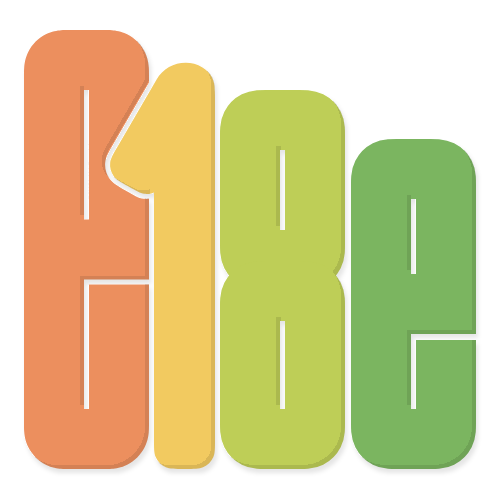

<h1 class="flex items-center gap-2">Ecosystem performance</h1>

- Community of people and projects working to modernize the JavaScript ecosystem
- Tries to fix the technical debt
  - Redundant packages (duplicates in `node_modules`)
  - Bloated packages (oversized, unused features)
  - Unmaintained packages (outdated, security issues)

<!-- Packages for everything, super deep dep tree -->